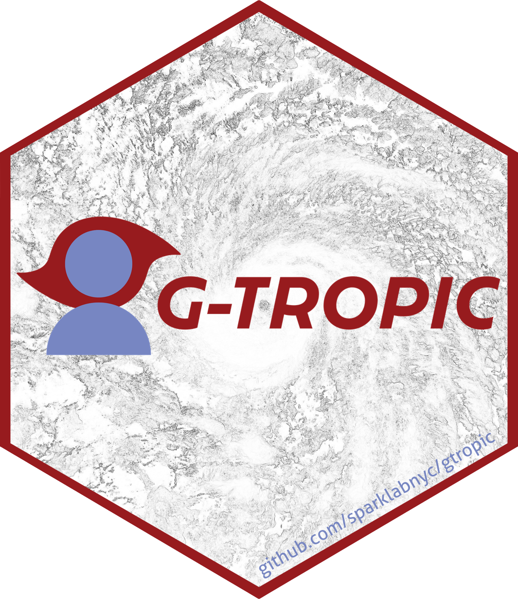

<!-- README.md is generated from README.Rmd. Please edit that file -->

# gtropic 

<!-- badges: start -->

[](https://www.gnu.org/licenses/gpl-3.0)
<!-- badges: end -->

## Overview

The R package `gtropic`

## Installation

The development version of `gtropic` can be installed from GitHub with:

``` r
# install.packages("pak")
pak::pak("sparklabnyc/gtropic")
```

`gtropic` can then be loaded and attached in your current R session as
usual with

``` r
library(gtropic)
```
