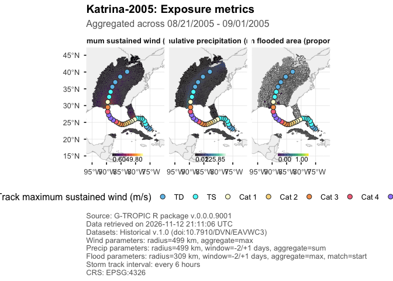
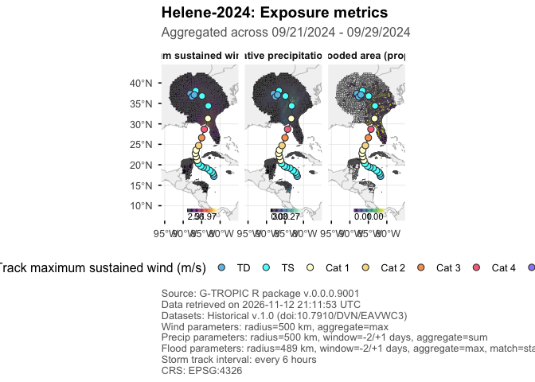

<!-- README.md is generated from README.Rmd. Please edit that file, then run
     devtools::build_readme(). -->

# gtropic 

<!-- badges: start -->

[](https://www.gnu.org/licenses/gpl-3.0)
<!-- badges: end -->

## Overview

The R package `gtropic` provides a retrieval, filtering, and plotting
client for the live G-TROPIC collection of tropical cyclone exposure
datasets, published and updated weekly on Harvard Dataverse. Exposure
datasets include wind, precipitation, and flooding data at second-level
administrative unit (ADM2) resolution for every ADM2 and International
Best Track Archive for Climate Stewardship (IBTrACS) recorded storm
globally, from 1980 to the present. Key features include:

- A cornerstone query function: `gtropic_data()`
- Discovery helpers for exploring the available vocabulary of
  administrative units and storms
- Version manifests for reproducible re-retrieval
- An on-disk cache enabled by default, with per-call bypass controls
- Publication-ready static and interactive plots

`STORM_ID` is G-TROPIC’s unique, preferred storm key for queries, joins,
grouping, and reproducible work. `STORM_NAME` is a convenient lookup and
display label in `Name-YYYY` form; a complete value can still match
multiple storms, including across basins, and `YYYY` is the published
`SEASON` year rather than necessarily the genesis calendar year. Use
`gtropic_storms(STORM_NAME = ...)` to inspect matches and find the
intended `STORM_ID`, then use that ID in `gtropic_data()` and downstream
analysis.

Explicit year and date filters select `STORM_GENESIS_DATE_UTC`.
G-TROPIC’s annual storm metadata, wind, zero-pair, and track files—and
the package’s temporal storm discovery and query organization—use that
genesis calendar year.

## Installation

The development version of `gtropic` can be installed from GitHub with:

``` r
# install.packages("pak")
pak::pak("sparklabnyc/gtropic")
```

`gtropic` can then be loaded and attached in your current R session as
usual with:

``` r
library(gtropic)
```

## Usage

``` r
library(gtropic)

# Quickly find Hurricane Katrina by its convenience label
katrina_matches <- gtropic_storms(STORM_NAME = "Katrina-2005")
katrina_matches
#> # A tibble: 1 × 4
#>   STORM_ID      STORM_NAME   USA_ATCF_ID STORM_GENESIS_DATE_UTC
#>   <chr>         <chr>        <chr>       <date>                
#> 1 2005236N23285 Katrina-2005 AL122005    2005-08-23

# This example has one match; if several appear, choose the intended row
katrina_id <- katrina_matches$STORM_ID[[1]]
katrina <- gtropic_data(
  STORM_ID = katrina_id,
  date_range = c(2005, 2005)
)
#> Discovering datasets in collection "gtropic".
#> Downloading 'metadata/adm2.parquet'.
#> Downloading '02_wind/storm_metadata/2005.parquet'.
#> Retrieving 10 files (165.5 MB) ; .
#> Downloading '02_wind/exposures/2005.parquet'.
#> Downloading '02_wind/zero_pairs/2005.parquet'.
#> Downloading '04_precip/2005.parquet'.
#> Downloading '03_flood/2005.parquet'.
#> Downloading '01_pop/2005.parquet'.
#> Downloading '02_wind/storm_tracks/2005.parquet'.
#> Downloading 'metadata/codebook.json'.
#> Downloading 'metadata/adm2_geometry_simplified.parquet'.
summary(katrina)
#> 
#> ── G-TROPIC data summary ───────────────────────────────────────────────────────
#> 
#> ── Sources ──
#> 
#> • Server: "dataverse.harvard.edu"
#> • Historical dataset: doi:10.7910/DVN/EAVWC3 v1.0
#> • Files retrieved: 10 (165.5 MB)
#> • Retrieved at: 2026-11-20 00:45:34 UTC
#> 
#> ── Tables ──
#> 
#> • wind: 1477 rows x 12 columns
#> • precip: 5908 rows x 3 columns
#> • flood: 237 rows x 7 columns
#> • zero_pairs: 39531 rows x 5 columns
#> • tracks: 64 rows x 10 columns
#> • pop: 1477 rows x 6 columns
#> • storm_metadata: 1 rows x 4 columns
#> • adm2: 1477 rows x 5 columns
#> • geometry: 1477 rows x 2 columns
#> • codebook: 7 entries (list)
#> • links: 1477 rows x 12 columns
#> 
#> ── Resolved filters ──
#> 
#> • ADM2 units: 1477
#> • Storms: 1
#> • Genesis window: 2005-01-01 to 2005-12-31
#> • Wind radius: 500 km
#> • Precipitation window: -2/ +1 days within 500 km
#> • Flood window: -2/+1 days within 500 km (match: "start")
#> 
#> ── Warnings ──
#> 
#> • precip_all_missing_adm2_ids: 86173395B10183828018242,
#> 86173395B33619167853359, 86173395B49833060083827, 86173395B5227574641069,
#> 86173395B64443584385378, and ... and 10 more
```

The `gtropic_data()` function returns a named list of tables that by
default includes:

- **`wind`** – one row per administrative unit per storm, for pairs
  where wind exposure was non-zero. This is the core exposure table.
- **`precip`** – one row per administrative unit per local calendar
  date, for dates falling near a storm’s passage for that ADM2.
- **`flood`** – one row per observed flood event.
- **`pop`** – population and population-weighted centroid data, per ADM2
  per year.
- **`adm2`** – the lookup table of administrative units.
- **`codebook`** – the dataset’s own documentation, as a nested list.
- **`zero_pairs`** – administrative unit-storm pairs with no measurable
  wind.
- **`tracks`** – raw storm-track observations.
- **`geometry`** – administrative boundaries, as an `sf` object.
- **`storm_metadata`** – storm names, identifiers, and genesis dates.
- **`links`** – see below.

> **Current precipitation limitation:** Some small or coastal ADM2 units
> may have no non-missing precipitation values because no ERA5-Land grid
> cell was assigned. Retrievals and automatic map captions identify
> affected units; see `?gtropic_known_limitations` for details and the
> planned dataset correction.

Pass a shorter `tables` vector when you do not need every table and want
to reduce transfer and storage requirements. The default includes
`geometry`, so it requires the suggested `sf` and `sfarrow` packages.

By default, `wind_radius_km = 500` retains returned `wind` records and
`links` whose published `STORM_DIST_KM` is at or below 500 km,
inclusively. Set it to `Inf` or `NULL` for no wind-distance bound. The
precipitation and flood radii remain independent, but their windows are
evaluated only for links retained by the wind-radius filter.

Every result also carries a **manifest** providing a record of which
published files went into the result, including their paths, dataset
versions, sizes and checksums. Saving it lets you reproduce the same
retrieval months later, even if the dataset has since been revised.

``` r
saveRDS(gtropic_manifest(katrina), "katrina-manifest.rds")
```

## Plotting

``` r
gtropic_plot(katrina)
```



``` r
# Find and retrieve Hurricane Helene (2024) by its unique storm identifier
helene_matches <- gtropic_storms(STORM_NAME = "Helene-2024")
helene_matches
#> # A tibble: 1 × 4
#>   STORM_ID      STORM_NAME  USA_ATCF_ID STORM_GENESIS_DATE_UTC
#>   <chr>         <chr>       <chr>       <date>                
#> 1 2024268N17278 Helene-2024 AL092024    2024-09-23
# This example has one match; if several appear, choose the intended row
helene_id <- helene_matches$STORM_ID[[1]]
helene <- gtropic_data(
  STORM_ID = helene_id,
  date_range = c(2024, 2024)
)
#> Discovering datasets in collection "gtropic".
#> Downloading 'metadata/adm2.parquet'.
#> Downloading '02_wind/storm_metadata/2024.parquet'.
#> Retrieving 10 files (175.3 MB) ; .
#> Downloading '02_wind/exposures/2024.parquet'.
#> Downloading '02_wind/zero_pairs/2024.parquet'.
#> Downloading '04_precip/2024.parquet'.
#> Downloading '03_flood/2024.parquet'.
#> Downloading '01_pop/2024.parquet'.
#> Downloading '02_wind/storm_tracks/2024.parquet'.
#> Downloading 'metadata/codebook.json'.
#> Downloading 'metadata/adm2_geometry_simplified.parquet'.

# Plot Helene's exposure data
gtropic_plot(helene)
```



See `vignette("plotting")` for vectorized multi-metric maps,
Saffir-Simpson track keys, gridlines, interactive maps, thresholds, and
more.

## Getting help

Extensive documentation is available on our pkgdown website as well as
offline within R. You can see the `gtropic` reference manual in R with:

``` r
help("gtropic")
```

A number of vignettes are available and can be browsed in R using:

``` r
browseVignettes("gtropic")
```

We recommend reading the vignettes in the following order:

- `vignette("getting-started")` introduces the cornerstone
  `gtropic_data()` function, running your first query, and how to
  navigate the resulting data.
- `vignette("filtering")` covers how all the spatio-temporal/storm
  filters in `gtropic_data()` combine, with a worked example.
- `vignette("linkage")` documents how to link precipitation/flood data
  to storm data and using the `links` table to perform joins without
  double-counting exposure rows.
- `vignette("plotting")` covers static and interactive maps, vectorized
  options, and publication-ready output.
- `vignette("versions-and-caching")` walks through reproducibility and
  download management best practices in `gtropic`.

## Citation

Please cite both the package and the underlying datasets. The dataset
DOIs and versions used by any given result are recorded in its manifest:

``` r
gtropic_manifest(katrina)
```
